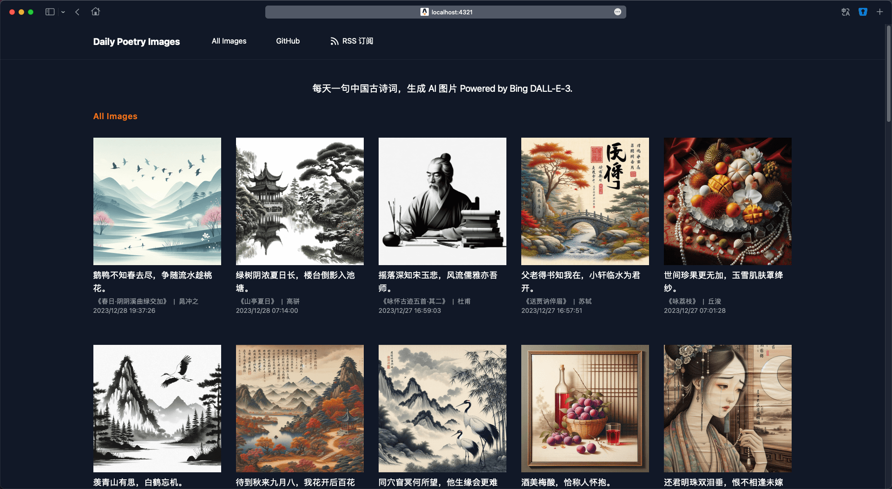
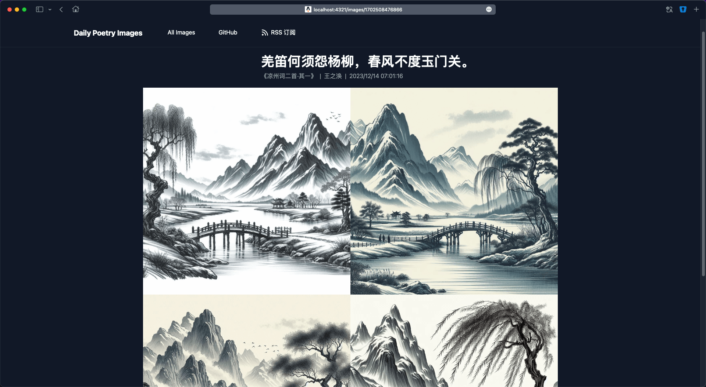

# daily-poetry-image

## 每天一句中国古诗词，生成 AI 图片 Powered by Bing DALL-E-3.

### 👉🏽 [Base On @liruifengv's daily-poetry-image](https://github.com/liruifengv/daily-poetry-image)

### 👉🏽 [Live](https://daily.fengj.link) https://daily.fengj.link

  最近一次生成时间: 2024/3/19 12:13:23

巴山楚水凄凉地，二十三年弃置身。

<<酬乐天扬州初逢席上见赠>> • 刘禹锡

## 项目介绍

-   本项目是基于 [Bing Image DALL-E-3](https://www.bing.com/images/create) 生成的图片，每天一句中国古诗词作为 Prompt。
-   GitHub Action 自动触发。
-   诗词由[今日诗词](https://www.jinrishici.com/)提供 API。
-   网站使用 [Astro](https://astro.build) 构建。

## 订阅

你可以使用 RSS 订阅每天的诗词配图：https://daily.fengj.link/rss.xml

[如何用 RSS 订阅？](https://zhuanlan.zhihu.com/p/55026716)

## 截图

## 灵感来源

-   [yihong0618/2023](https://github.com/yihong0618/2023)

## License

MIT
